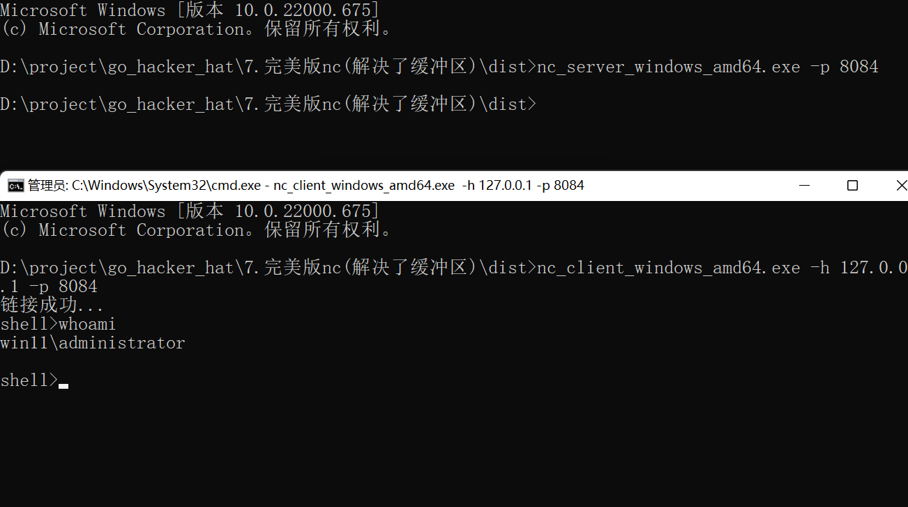
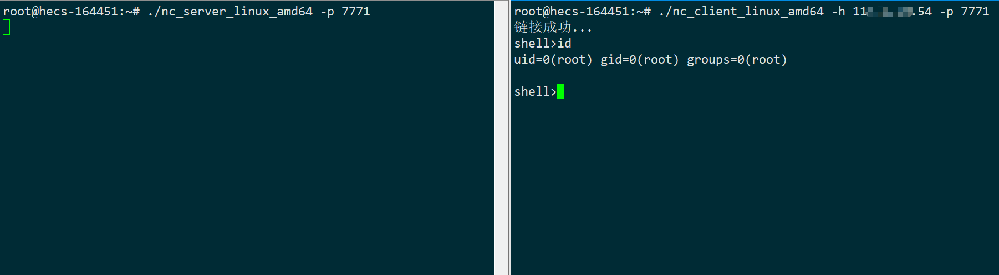

# go-nc

> 使用go语言实现nc , 目前只支持命令执行

## 1.引子

在看黑帽 go 一书中 , 使用go编写nc , 和python黑帽子一样 , 书中都没解决tcp粘包问题 , 故自己实现一下 , 然后就踩坑了因为网上流传的 go 解决粘包的代码是有bug的  , 故记录一下

## 2.介绍

```
1.实现了windows和linux的编码问题
2.真正实现了解决tcp粘包问题
3.支持多个客户端同时链接nc
4.等等...
```

## 3.使用

直接下载编译后的版本

windows

```shell
# nc服务端
nc_server_windows_amd64.exe -p 8084

# nc客户端
nc_client_windows_amd64.exe -h 127.0.0.1 -p 8084
```



linux

```shell
# nc服务端
./nc_server_linux_amd64 -p 8084

# nc客户端
./nc_client_linux_amd64 -h 127.0.0.1 -p 8084
```



## 4.免责声明🧐

本工具仅面向合法授权的企业安全建设行为，如您需要测试本工具的可用性，请自行搭建靶机环境。

在使用本工具进行检测时，您应确保该行为符合当地的法律法规，并且已经取得了足够的授权。请勿对非授权目标进行扫描。

如您在使用本工具的过程中存在任何非法行为，您需自行承担相应后果，我们将不承担任何法律及连带责任。
